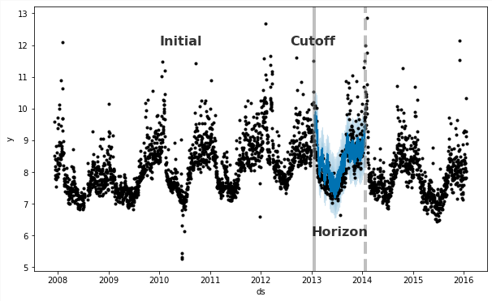

<style type="text/css">
div.main-container {
  max-width: 1600px;
  margin-left: auto;
  margin-right: auto;
}
</style>

```{r, message=FALSE}
library(dplyr)
library(ggplot2)
library(prophet)
library(lubridate)
library(cowplot)
```

## Problema

Queremos **predecir el número de visitantes de un local de ropa** en un determinado momento. 

### Carga de datos

El dataset consiste en información real de 8 meses de visitantes de un local de ropa localizado en un shopping de gran tamaño.

```{r}
shopping <- read.csv('local-shopping_prophet.csv') %>% 
  rename(.,visitantes=Total.de.Visitantes) %>%
  mutate(Dia = ymd(Dia))
glimpse(shopping)
```

Se observa que la serie de tiempo presenta un comportamiento cíclico con algunos eventos atípicos:

* Aumentos debidos a promociones y Navidad

* Caídas por cierre del local o caídas del sistema de medición

```{r}
ggplot(shopping, aes(Dia, visitantes)) + geom_line() + theme_bw() + labs(title='Visitantes por día')
```

```{r}
ggplot(shopping, aes(Dia, visitantes)) + geom_line() + geom_point(color='forestgreen') + theme_bw() + labs(title='Visitantes por día')
```

# Técnicas de suavizado

Una primera aproximación puede ser tratar de utilizar técnicas de suavizado.

En este caso estamos utilizando **loess** como una herramienta gráfica con el comando `geom_smooth()` de ggplot.

```{r}
ggplot(shopping, aes(Dia, visitantes)) + geom_point(color='forestgreen') + geom_smooth() + theme_bw() + labs(title='Visitantes por día: Suavizado')
```

Si bien está suavizando, el resultado es bastante pobre ya que el modelo no está logrando representar bien la variabilidad de los datos.

## Distintas ventanas

Ahora realizamos 4 modelos de LOESS modificando la ventana (**span**) para cada uno de ellos.

Especificamos: 

*formula*: fórmula que especifica la respuesta numérica y el predictor numérico. 

*na.acción*: la acción que se realizará con valores NA en la respuesta o predictores.

*model*: ¿Debería devolverse el dataframe del modelo? (T/F)

*span*: el parámetro α que controla el grado de suavizado.

```{r, warning=FALSE}
loess=stats::loess(visitantes~as.numeric(Dia), data = shopping, na.action = 'na.exclude', model = T, span=0.01)
shopping['loess']=predict(loess,shopping)
loess_1 = ggplot(shopping, aes(Dia,visitantes)) + geom_point() + geom_line(aes(y=loess), color='firebrick', size=1) + 
  labs(title= "LOESS span:0.01") + theme_bw() 

loess=stats::loess(visitantes~as.numeric(Dia), data = shopping, na.action = 'na.exclude', model = T, span=0.25)
shopping['loess']=predict(loess,shopping)
loess_2 = ggplot(shopping, aes(Dia,visitantes)) + geom_point() + geom_line(aes(y=loess), color='forestgreen', size=1) + 
  labs(title= "LOESS span:0.25") + theme_bw() 

loess=stats::loess(visitantes~as.numeric(Dia), data = shopping, na.action = 'na.exclude', model = T, span=0.5)
shopping['loess']=predict(loess,shopping)
loess_3 = ggplot(shopping, aes(Dia,visitantes)) + geom_point() + geom_line(aes(y=loess), color='steelblue', size=1) + 
  labs(title= "LOESS span:0.50") + theme_bw() 

loess=stats::loess(visitantes~as.numeric(Dia), data = shopping, na.action = 'na.exclude', model = T, span=0.75)
shopping['loess']=predict(loess,shopping)
loess_4 = ggplot(shopping, aes(Dia,visitantes)) + geom_point() + geom_line(aes(y=loess), color='purple', size=1) + 
  labs(title= "LOESS span:0.75") + theme_bw() 

cowplot::plot_grid(loess_1, loess_2, loess_3,loess_4)
```

Se nota que para un **span muy pequeño** nuestro modelo va a tener un problema de **OVERFITTING**: no va a poder generalizar. Mientras que para **spans grandes** tenemos un problema de **UNDERFITTING**: nuestro modelo no logra captar bien la variabilidad del fenómeno.

# Prophet

Es un modelo para **pronosticar datos de series de tiempo basado en un modelo aditivo** donde las tendencias no lineales se ajustan a la estacionalidad anual, semanal y diaria, más los efectos de eventos especiales. Funciona mejor con series de tiempo que tienen fuertes efectos estacionales y varias temporadas de datos históricos. Es robusto ante datos faltantes y cambios de tendencia, y normalmente maneja bien valores atípicos.

[Prophet](https://facebook.github.io/prophet/) es un software de código abierto lanzado por Facebook. En este caso, vamos a trabajar sobre la implementación de Prophet en R.

## Preparacion del dataset

Prophet requiere que le pasemos el dataset con:

  * **ds**: la variable temporal 

  * **y**: la variable a predecir 

```{r}
# Eliminamos observaciones con menos de 250 visitantes (cuestion de negocio)
shopping[shopping['visitantes']<250,'visitantes'] = NA
# Creamos el dataset
prophet_df = shopping %>% select(Dia, visitantes) %>% rename(., ds=Dia, y=visitantes)
```

## Modelo

El modelo subyacente es el propuesto por Harvey & Peters (1990): 

$y(t)=g(t)+s(t)+h(t)+\varepsilon_t$

 * $y(t):$ variable a predecir

 * $g(t):$ función de tendencia

 * $s(t):$ cambios periódicos

 * $h(t):$fectos de vacaciones (eventos atípicos)$

 * $\varepsilon_t:$error

El modelo es similar a los GAM:

1) Cada **variable es una función** (posiblemente) no lineal del tiempo
2) Los **efectos** de los componentes **se suman** (efectos aditivos)

En palabras de los autores:

*"We  are,  in  effect,  framing  the  forecasting  problem  as  a  curvefitting  exercise,  which is  inherently  different  from  time  series  models  that  explicitly  account  for  the  temporal dependence structure in the data"* Taylor & Letham: *Forecasting at Scale* (2017)

Hay muchos parámetros para tener en cuenta. Veremos algunos:

  * **df**: dataframe
  
  * **growth**: tipo de tendencia: lineal o logistica

  * **yearly.seasonality**: hay estacionalidad anual?
  
  * **daily.seasonality**: hay estacionalidad diaria?
  
  *  **holidays**: dataframe con fechas de vacaciones/eventos especiales

### Modelo básico

La función `prophet` crea el modelo, podemos pasarle o no el dataframe.

La función `prophet.fit` aplica un modelo creado a un dataframe.

```{r}
# Llamamos solo al modelo
prophet_base = prophet()
# Le pasamos el dataset
prophet_base = fit.prophet(m = prophet_base, prophet_df) 
```

Notemos que el modelo automáticamente deshabilita la estacionalidad anual y diaria.

#### Gráfico del modelo

Llamando a `plot` obtenemos el valor predicho del modelo y el valor original.

Es difícil de notar pero el modelo realiza predicciones aun para los días en los cuales no hay datos.

```{r}
plot(prophet_base,fcst=predict(prophet_base, prophet_df)) +theme_bw()
```

#### Componentes del modelo

La funcion `prophet_plot_components` nos devuelve los efectos de los componentes en nuestra variable a predecir.

```{r}
prophet_plot_components(prophet_base, fcst=predict(prophet_base, prophet_df))
```

En este caso tenemos la tendencia de los visitantes y la estacionalidad semanal. Esta última parece tener bastante sentido ya que nos muestra que hay mayor cantidad de visitantes durante el fin de semana.

### Modelo con estacionalidad mensual

La función `add_seasonality` nos permite agregar nuevas estacionalidades. Las estacionalidades se modelan utilizando series de Fourier que nosotros debemos definir.

Definimos:

  * **m**: modelo
  
  * **name**: nombre de la estacionalidad
  
  * **period**: cantidad de dias del periodo
  
  * **fourier.order**: orden de la serie de fourier para modelar la estacionalidad

```{r}
# Llamamos solo al modelo
prophet_mensual=prophet()
# Agregamos la estacionalidad mensual
prophet_mensual=add_seasonality(m=prophet_mensual, name='monthly', period=365/12, fourier.order = 4)
# Le pasamos el dataset
prophet_mensual = fit.prophet(m = prophet_mensual, prophet_df) 
```

Notemos que sigue deshabilitando la estacionalidad anual y diaria.

#### Gráfico del modelo

```{r}
plot(prophet_mensual,fcst=predict(prophet_mensual, prophet_df)) +theme_bw()
```

#### Componentes del modelo

```{r}
prophet_plot_components(prophet_mensual, fcst=predict(prophet_mensual, prophet_df))
```

Notemos que la tendencia y estacionalidad semanal se mantiene y ahora se agrega la tendencia mensual que habíamos incorporado. Nos indica que el ciclo mensual se caracteriza por un crecimiento en la mitad de mes.

### Modelo completo 

Como último paso vamos a agregar las ventas de navidad y ciertos días de promociones como eventos especiales.

#### Dataframe de eventos

Creamos el dataframe de eventos con: nombre del evento, fechas y una "ventana" para definir si el evento se estira a ciertos dias.

```{r, warning=FALSE}
# Navidad
christmas = data.frame(holiday= 'christmas',
  ds=ymd(c('2017-12-16','2017-12-17','2017-12-18',
                        '2017-12-19','2017-12-20','2017-12-21',
                        '2017-12-22','2017-12-23')),
  lower_window= 0,
  upper_window= 0)

# Promociones
big_sales = data.frame(
  holiday= 'big_sales',
  ds= ymd(c('2017-09-16','2017-10-08','2017-10-14',
                        '2017-11-20','2017-12-03','2017-12-30')),
  lower_window= 0,
  upper_window= 0)

holidays= bind_rows(christmas, big_sales)
glimpse(holidays)
```

```{r}
# Llamamos al modelo con el dataset de eventos
prophet_full=prophet(holidays = holidays)
# Agregamos la estacionalidad mensual
prophet_full=add_seasonality(prophet_full, name='monthly', period=30.5, fourier.order = 4)
# Le pasamos el dataset
prophet_full = fit.prophet(m = prophet_full, prophet_df) 
```

Fijense que el modelo automáticamente deshabilita la estacionalidad anual y diaria.

#### Gráfico del modelo

```{r}
plot(prophet_full,fcst=predict(prophet_full, prophet_df)) +theme_bw()
```

#### Componentes del modelo

```{r}
prophet_plot_components(prophet_full, fcst=predict(prophet_full, prophet_df))
```

La tendencia y estacionalidad semanal se mantienen aproximadamente igual. La estacionalidad mensual cambia bastante y se observa que existen tres picos en el ciclo mensual. Por su parte, los eventos se modelan como pequeños saltos o picos.

## Evaluación del modelo

La funcion `cross_validation` permite realizar pronósticos realizando un esquema de cross-validation temporal y, a partir de ellos, obtener ciertas métricas de performance.

  * **horizon**: horizonte del pronóstico. Cuánto tiempo deseo predecir
  
  * **period**: período entre fechas de análisis. Cuánto voy corriendo mi ventana
  
  * **initial**: período inicial de entrenamiento
   
  * **units**: unidad de tiempo utilizada 
   


La función `cross_validation` devuelve un dataframe en el cual para cada grupo/fold de **cutoff** se obtiene para cada fecha dentro del **horizonte**: valor predicho, valor inferior del intervalo y valor superior del intervalo.

Una vez que se obtiene este dataframe se pueden obtener métricas de evaluación con la función `performance_metrics`. Definimos la proporción de datos que se utilizarán en cada ventana móvil para calcular las métricas (`rolling_window`).

El procedimiento es el siguiente: 

1. Se calcula el horizonte de predicción de cada observación: ds - cutoff
2. Se ordena de menor a mayor horizonte
3. Se calculan las métricas con la cantidad de observaciones definidas por **rolling_window**.  
    a. Comienza realizandolo para cada horizonte
    b. Si los datos dentro de un **horizonte** no son suficientes comienza a usar observaciones de horizontes aledaños. 

Entonces, según el valor de **rolling_window** se tienen los siguientes casos: 

  * **rolling_window** < 0: se calculan las métricas para cada observación por separado
  * **rolling_window** = 0: se calculan las métricas para cada horizonte por separado
  * **rolling_window** 0 < w < 1: se calculan las métricas para cada horizonte usando el x% de las observaciones del dataframe
  * **rolling_window** = 1: se calculan las métricas para todas las observaciones

Realicemos la evaluación para nuestros modelos

### Modelo básico

Usamos `cross_validation` con un período inicial de 45 días, un horizonte de 15 días y desplazaremos la predicción cada 7 días

```{r}
cv_base = cross_validation(prophet_base, initial = 45, period = 7, horizon = 15, units = 'days')
cv_base
```
Obtenemos las métricas de performance

```{r}
performance_metrics(cv_base, rolling_window = 0.25)
```

#### Breve explicación de la construcción de las métricas

Construimos el horizonte para nuestro set de predicciones 

```{r}
# Construimos el horizonte
cv_base_explicacion = cv_base %>% mutate(horizon = ds-cutoff)
cv_base_explicacion[order(cv_base_explicacion$horizon),]
```
Observemos cuantas observaciones tenemos por horizonte

```{r}
cv_base_explicacion %>% group_by(horizon) %>% count()
```
La ventana se define de la siguiente manera:

```{r}
# El código se adaptó del código fuente de la librería
n_observaciones_ventana = function(rolling_window, cv_df){
  w <- as.integer(rolling_window * nrow(cv_df))
    if (w >= 0) {
      w <- max(w, 1)
      w <- min(w, nrow(cv_df))
    }
  return(w)
}
```

**Rolling window < 0**

```{r}
rolling_window = -1
# Cantidad de observaciones
n_observaciones_ventana(rolling_window, cv_base)
# Set de metricas
performance_metrics(cv_base, rolling_window=rolling_window)
```
**Rolling window = 0**

```{r}
rolling_window = 0
# Cantidad de observaciones
n_observaciones_ventana(rolling_window, cv_base)
# Set de metricas
performance_metrics(cv_base, rolling_window=rolling_window)
```
**Rolling window = 0.25**

```{r}
rolling_window = 0.25
# Cantidad de observaciones
n_observaciones_ventana(rolling_window, cv_base)
# Set de metricas
performance_metrics(cv_base, rolling_window=rolling_window)
```
**Rolling window = 1**

```{r}
rolling_window = 1
# Cantidad de observaciones
n_observaciones_ventana(rolling_window, cv_base)
# Set de metricas
performance_metrics(cv_base, rolling_window=rolling_window)
```


### Modelo mensual

Usamos `cross_validation` con un periodo inicial de 45 días, un horizonte de 15 días y desplazaremos la predicción cada 7 días

```{r}
cv_mensual = cross_validation(prophet_mensual, initial = 45, period = 7, horizon = 15, units = 'days')
cv_mensual
```
Obtenemos las métricas de performance

```{r}
performance_metrics(cv_mensual, rolling_window = 0.25)
```

### Modelo completo

Usamos `cross_validation` con un período inicial de 45 días, un horizonte de 15 días y desplazaremos la predicción cada 7 días

```{r}
cv_full = cross_validation(prophet_full, initial = 45, period = 7, horizon = 15, units = 'days')
cv_full
```

Obtenemos las métricas de performance

```{r}
performance_metrics(cv_full, rolling_window = 0.25)
```

### Gráficos

La función `plot_cross_validation_metric` nos permite graficar el comportamiento de una métrica de performance para los distintos horizontes

```{r}
mae_base = plot_cross_validation_metric(cv_base, metric = 'mae', rolling_window = 0.25) + 
            theme_bw() + labs(title="Modelo Base: MAE")
mae_mensual = plot_cross_validation_metric(cv_mensual, metric = 'mae', rolling_window = 0.25) +
           theme_bw() + labs(title="Modelo Mensual: MAE")
mae_full = plot_cross_validation_metric(cv_full, metric = 'mae', rolling_window = 0.25) +
            theme_bw() + labs(title="Modelo Full: MAE")

cowplot::plot_grid(mae_base, mae_mensual, mae_full)
```

## Gráficos interactivos

Prophet también nos permite realizar gráficos interactivos que suelen ser muy útiles para presentar los resultados.

```{r, fig.width=8.5,fig.height=6}
dyplot.prophet(prophet_full, fcst=predict(prophet_full, prophet_df))
```

## Fuentes

  * Github: https://github.com/facebook/prophet
  * Paper: https://peerj.com/preprints/3190.pdf
  * Blog: https://research.fb.com/prophet-forecasting-at-scale/
  * Documentación: https://facebook.github.io/prophet/docs/
