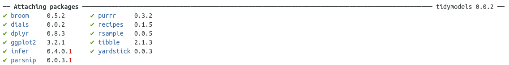

Las librerías de _Tidymodels_ fueron realizadas con el objetivo de incorporarse al flujo de trabajo del _tidyverse_. A diferencia de versiones previas, como Caret, son modulares, y cada librería tiene un objetivo acotado. 


- `rsample` - Diferentes tipos de remuestreo
- `recipes` - Organización de las transformaciones para el preprocesamiento de la información de forma tal que sea lo más reproducible posible. En este sentido, se acerca a los _pipelines_ de sk-learn
- `parnip` - Un interfaz común para crear modelos, independientemente de la implementación (paquete)
- `yardstick` - Metricas de performance del modelo.


```{r echo=TRUE, message=FALSE, warning=FALSE}
library(tidymodels)
```



Veamos un ejemplo con iris


## Preprocesamiento

### Remuestreo de datos

con `rsample::initial_split()` creamos una división entre train y test

```{r}
iris_split <- initial_split(iris, prop = 0.6)
iris_split
```
cuando llamamos al objeto `iris_split` nos muestra la cantidad de elementos en train/test/total

Si queremos recuprar el dataset de entrenamiento, utilizamos el comando `training()`

```{r}
iris_split %>%
  training()  
```

### Receta de transformaciones

Con `recipes::recipe()` indicamos que comenzamos un pipeline de preprocesamiento, indicando cual es la variable a predecir, con `Species ~.`.

El objetivo de realizar el preprocesamiento de esta manera es que para muchas etapas del preprocesamiento, como puede ser el cálculo de la media para la imputación, sólo podemos utilizar la información del set de entrenamiento para evitar el _information leaking_. Por ello, si construimos un pipeline donde se calcula todo sobre entrenamiento, después es más sencillo reutilizarlo en test, sin cometer errores de este tipo.

utilizando `recipes` __entrenamos__ el preprocesamiento.


`recipe()` Empieza un nuevo set de transformaciones para ser aplicadas. 

`prep()` Ejecuta las transformaciones en el set de entrenamiento

Cada tranformación es un _step_(paso). Las funciones son tipos específicos de pasos. En este caso utilizamos:

`step_corr()` Elimina las variables que tienen una correlación alta con otras variables
`step_center()` Centra los datos para que tengan media cero
`step_scale()` Normaliza los datos para que tengan desvío estandar de 1.

Las funciones `all_predictors` y `all_outcomes` ayudan a espcificar sobre qué valores hay que realizar las transformaciones.

```{r warning=FALSE}
iris_recipe <- training(iris_split) %>%
  recipe(Species ~.) %>%
  step_corr(all_predictors()) %>%
  step_center(all_predictors(), -all_outcomes()) %>%
  step_scale(all_predictors(), -all_outcomes()) %>%
  prep()

iris_recipe
```


### Aplicamos la receta en los datos de test y train

Con la función `bake()` podemos aplicar la _receta_ que preparamos antes para los datos de entrenamiento. Para ello el primer objeto que pasamos es la _receta_ y como parámetro de _bake_ pasamos el dataset de test (recuperado con la función `testing` de rsample)

```{r warning=FALSE}
iris_testing <- iris_recipe %>%
  bake(testing(iris_split)) 

iris_testing
```

Dado que la receta ya fue construida con los datos de entrenamiento, no tendría sentido utilizar el mismo pipeline para recuperar estos datos. Para ello utilizamos la función `juice` directamente sobre la receta.


```{r warning=FALSE}
iris_training <- juice(iris_recipe)

 iris_training
```

## Entrenamiento de modelos

En R hay muchos paquetes que implementan el mismo tipo de modelo. Normalmente cada implementación define los parámetros del modelo de forma distinta. Por ejemplo, para el modelo Random Forest, la librería `ranger` define el número de árboles como num.trees, mientras que la librería `randomForest` lo nombra ntree. 

Al igual que la vieja librería caret, tidymodels remplaza la interfaz, pero no el paquete. Es decir, no es una nueva implementación de los modelos, sino una interfaz que unifica las diferentes sintaxis.

- En este caso, la función `rand_forest` incializa el modelo de Random Forest, definiendo sus parámetros.
- La función `set_engine` sirve para especificar qué implementación utilizar.
- Para entrenar el modelo, se utiliza la función `fit`

```{r}
iris_ranger <- rand_forest(trees = 100, mode = "classification") %>%
  set_engine("ranger") %>%
  fit(Species ~ ., data = iris_training)
```


```{r}
iris_rf <-  rand_forest(trees = 100, mode = "classification") %>%
  set_engine("randomForest") %>%
  fit(Species ~ ., data = iris_training)
```


```{r}
iris_noengine <- rand_forest(trees = 100, mode = "classification") %>%
  fit(Species ~ ., data = iris_training)
```


## Predicciones

Para predecir los datos de test utilizamos la conocida función `predict`. Sin embargo, cuando utilizamos esta función sobre un objeto de la librería `parsnip` devuelve un _tibble_

```{r}
predict(iris_ranger, iris_testing)
```

Para agregar las predicciones a los datos de test podemos utilizar la función `bind_cols`

```{r}
iris_ranger %>%
  predict(iris_testing) %>%
  bind_cols(iris_testing)  
```


## Validación

Con la función `yardstick::metrics()` podemos medir la performance del modelo. Elige automáticamente las métricas apropiadas dado el tipo de modelo. Necesitmaos aclarar cuales son los datos predichos,_estimate_ y reales, _truth_.

```{r}
iris_ranger %>%
  predict(iris_testing) %>%
  bind_cols(iris_testing) %>%
  metrics(truth = Species, estimate = .pred_class)
```

```{r}
iris_rf %>%
  predict(iris_testing) %>%
  bind_cols(iris_testing) %>%
  metrics(truth = Species, estimate = .pred_class)
```

## Metricas por clasificador

Si en el predict elegimos `type="prob"` 

```{r}
iris_ranger %>%
  predict(iris_testing, type = "prob")  
```


```{r}
iris_probs <- iris_ranger %>%
  predict(iris_testing, type = "prob") %>%
  bind_cols(iris_testing)

iris_probs
```

Con el tibble iris_probs es fácil calcular métodos de curva, como la ROC, utilizando la función `roc_curve`

```{r}
iris_probs%>%
  roc_curve(Species, .pred_setosa:.pred_virginica)
```

finalmente, con la función `autoplot` podemos graficar las curvas. Dado que el resultado es un objeto ggplot, podemos hacer otras modificaciones posteriores. 

```{r}
iris_probs%>%
  roc_curve(Species, .pred_setosa:.pred_virginica) %>%
  autoplot()+
  ggthemes::theme_fivethirtyeight()+
  labs(title = 'Curvas ROC')
```

Si queremos un tibble con la clase predicha y la probabilidad de cada clase, podemos utilizar `bind_cols` para juntar los resultados de ambos tipos

```{r}
predict(iris_ranger, iris_testing, type = "prob") %>%
  bind_cols(predict(iris_ranger, iris_testing)) %>%
  bind_cols(select(iris_testing, Species))
```


si utilizamos `metrics` sobre estos resultados, obtenemos además de accuracy y kap, el log loss y el area debajo de la curva ROC.

```{r}
predict(iris_ranger, iris_testing, type = "prob") %>%
  bind_cols(predict(iris_ranger, iris_testing)) %>%
  bind_cols(select(iris_testing, Species)) %>%
  metrics(truth=Species, .pred_setosa:.pred_virginica, estimate = .pred_class)
```


