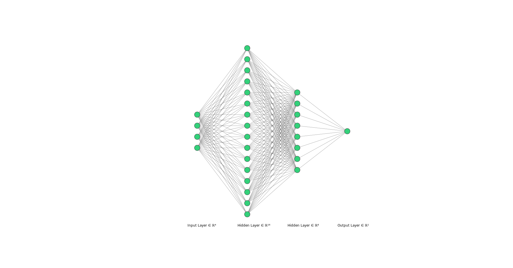

<style type="text/css">
div.main-container {
  max-width: 1400px;
  margin-left: auto;
  margin-right: auto;
}
</style>

# Redes Neuronales

La idea central de esta clase es presentar a las redes neuronales como modelos muy flexibles y potentes que se pueden considerar como **aproximadores universales**. Se desarrollarán de manera superficial conceptos vinculados a la construcción de una red neuronal densa, funciones de activación y algunas conceptos clave del entrenamiento/fitting de una red.

Esta clase se encuentra basada en el [tutorial de regresión de Tensorflow para R](https://tensorflow.rstudio.com/tutorials/keras/regression)

## Keras

Para trabajar con redes neuronales vamos a utilizar la librería [__KERAS__](https://keras.rstudio.com/)

### Instalación

Keras utiliza como backend __TensorFlow__. Para poner todo en funcionamiento necesitamos instalar ambas cosas, la secuencia de pasos es:

1. `install.packages("keras")`
2. `library(keras)`
3. `install_keras()`

La función `install_keras()` realiza una instalación por default de basada en el CPU. Es posible realizar una instalación para trabajar con  GPU.
Para una forma de instalación más completa y flexible se pueden seguir las instrucciones del siguiente link: [Instalación Tensorflow R](https://tensorflow.rstudio.com/install/index.html) 

```{r, message=FALSE, warning=FALSE}
# Importamos las librerías
library(tidyverse)
library(tidymodels)
library(keras)
library(tensorflow)
library(ggthemes)
# Fijamos semilla
set.seed(22)
```

## Dataset

Vamos a trabajar sobre el dataset de Properati, que ya utilizamos en clases anteriores 

```{r}
# Levantamos dataset preprocesado
datos_properati <- read.csv("../clase 6/properati_preprocesado_2022.csv")
# Creamos nueva variable de superficie descubierta
datos_properati = datos_properati %>%
  mutate(surface_uncovered = surface_total - surface_covered) %>% 
  # Eliminamos algunas variables
  select(-c(id, surface_total, precio_en_miles))
```

Observamos los primeros registros de la tabla:

```{r}
datos_properati %>% head()
```

## Modelo lineal

Vamos a realizar dos modelos lineales para establecer un baseline de performance para comparar los modelos de redes neuronales.
Comenzamos observando la relación entre precio y superficie cubierta con apertura por tipo de propiedad:

```{r}
ggplot(datos_properati, aes(x=surface_covered, y=price, color=property_type)) +
  geom_point(alpha=0.5) +
  theme_bw() +
  facet_wrap(~property_type) +
  labs(title="Relación Superficie Cubierta y Precio", x="Superficie Cubierta", y="Precio")
```

Ahora realizamos un split entre datos de entrenamiento (75%) y evaluación (25%)

```{r}
# Partición Train y Test, indicando proporción
split_modelo_lineal <- initial_split(datos_properati, prop = 0.75)
train_modelo_lineal <- training(split_modelo_lineal)
test_modelo_lineal <- testing(split_modelo_lineal)
```

Vamos a realizar dos modelos lineales clásicos:

**Modelo Básico**

$E(precio) = \beta_0+\beta_1SuperficieCubierta + \beta_2TipoPropiedad$

**Modelo Completo**

$E(precio) = \beta_0+ \beta_1SuperficieCubierta + \beta_2TipoPropiedad + \beta_3SuperficieDescubierta + \beta_4L3 + \beta_5Habitaciones + \beta_6Baños$

Entrenamos ambos modelos

```{r}
# Entrenamos el modelo básico
modelo_lineal_basico <- lm(formula = price ~ surface_covered + property_type, data = train_modelo_lineal)

# Entrenamos el modelo completo
modelo_lineal_completo <- lm(formula = price ~., data = train_modelo_lineal)
```

Predecimos los valores sobre el dataset de train y obtenemos los valores de RMSE y MAE

```{r}
# Listado de modelos
modelos_lineales = list(modelo_lineal_basico = modelo_lineal_basico, modelo_lineal_completo = modelo_lineal_completo)

# Realizamos predicciones en train
lista_predicciones_training = map(.x = modelos_lineales, .f = augment) 

# Obtenemos las métricas de performance en train
performance_modelos_lineales_train <- map_dfr(.x = lista_predicciones_training, .f = metrics, truth = price, estimate = .fitted, .id="modelo") %>%
                                              filter(.metric!="rsq") %>% 
                                              arrange(.metric, modelo) %>% 
                                              mutate(.estimate= round(.estimate, digits = 2))
performance_modelos_lineales_train
```

Predecimos los valores sobre el dataset de test y obtenemos los valores de RMSE y MAE

```{r}
# Realizamos predicciones en test
lista_predicciones_testing = map(.x = modelos_lineales, .f = augment, newdata = test_modelo_lineal) 

# Obtenemos las métricas de performance en test
performance_modelos_lineales_test <- map_dfr(.x = lista_predicciones_testing, .f = metrics, truth = price, estimate = .fitted, .id="modelo") %>%
                                              filter(.metric!="rsq") %>% 
                                              arrange(.metric, modelo) %>% 
                                              mutate(.estimate= round(.estimate, digits = 2))
performance_modelos_lineales_test
```

## Redes Neuronales Densas

Las redes neuronales densas (**Fully Connected Neural Networks**) son un tipo de red neuronal artificial donde todas las neuronas de una capa (**layer**) se encuentran conectadas con todas las neuronas de la capa siguiente.

Este tipo de redes neuronales no realizan supuestos sobre la estructura de los datos de input de la red: cada observación o ejemplo es representada por un vector numérico. 

### Preprocesamiento de datos

En nuestro caso va a ser necesario realizar una transformación de las variables categóricas *property_type* y *l3*. Para el preprocesamiento vamos a utilizar la librería `recipes` para seguir lo planteado por el tutorial previamente citado. 

En esta preparación vamos a transformar a una representación numérica a las variables *property_type* y *l3* mediante one-hot encoding

```{r}
library(recipes)
properati_redes <- recipe(price ~ ., datos_properati) %>%
  # Realizamos one-hot encoding de la variable tipo de propiedad
  step_dummy(property_type, one_hot = TRUE) %>%
  # Realizamos one-hot encoding de la variable l3
  step_dummy(l3, one_hot = TRUE) %>%
  prep() %>%
  bake(new_data = NULL)

properati_redes %>% head()
```

Ahora realizamos un split entre datos de entrenamiento (75%) y evaluación (25%) para los datos transformados para redes neuronales

```{r}
# Partición Train y Test, indicando proporción
split_redes <- initial_split(properati_redes, prop = 0.75)
train_redes <- training(split_redes)
test_redes <- testing(split_redes)
```

Adicionalmente separamos nuestras variables predictoras de la variable a predecir (precio)

```{r}
# Variables predictoras
variables_train <- train_redes %>% select(-price)
variables_test <- test_redes %>% select(-price)

# Variable a predecir
precio_train <- train_redes %>% select(price) %>% as.matrix()
precio_test <- test_redes %>% select(price) %>% as.matrix()
```

### Normalización

La normalización ayuda a que el proceso de optimización sea más rápido. Aunque rara vez es estrictamente necesario es una práctica muy usual en el trabajo con redes neuronales.

Para normalizar vamos a generar una capa que se encargue de esto con `layer_normalization` y luego con la función `adapt` fiteamos dicha capa a los datos. Es en este segundo paso que se calcula la media y varianza de las variables.

```{r, warning=FALSE, message=FALSE, error=FALSE}
# Instanciamos la capa de normalización
capa_normalización <- layer_normalization()
# Fiteamos la capa a nuestros datos
capa_normalización %>% adapt(as.matrix(variables_train))
# Podemos observar la media de cada variable
capa_normalización$mean
```

## Red densa sencilla

Vamos a comenzar realizando una red muy sencilla:

  * Vamos a usar las variables de *surface_covered* y *property_type* 
  * Vamos a usar sólo una capa con una única neurona

Comenzamos preparando los datos para esta red sencilla y generando un normalizador específico

```{r}
# Obtenemos las variables de interés
variables_train_red_sencila <-  variables_train %>% select(surface_covered, property_type_Casa,
                                                     property_type_Departamento, property_type_PH) %>% as.matrix()

variables_test_red_sencila <-  variables_test %>% select(surface_covered, property_type_Casa,
                                                     property_type_Departamento, property_type_PH) %>% as.matrix()
# Generamos el normalizador de la red sencilla
normalizador_sencillo <- layer_normalization(input_shape = shape(4), axis = NULL)
normalizador_sencillo %>% adapt(variables_train_red_sencila)
```

### Construcción de la red

Para armar el modelo primero definimos el tipo de modelo. Para eso usamos `keras_model_sequential()` que nos permite simplemente apilar capas de la red. 

  * En la primera capa se puede aclarar el input_shape. En este caso es **unidimensional**  pero puede ser un tensor de cualquier dimensión

  * Las capas se agregan con pipes `%>%`

  * La última capa tiene la misma cantidad de unidades que nuestro output. En este caso, como es un problema de regresión, nuestro output es una única unidad.

Como queremos construir redes densas o fully connected vamos a utilizar una capa densa: `layer_dense`. La operación que realiza una capa densa es:

`output = activation(dot(input, kernel) + bias)`

En términos matemáticos:

$A^{[l]}=g(A^{[l-1]} \cdot W^{[l]} + b^{[l]})$

Los argumentos para configurar este tipo de capas son:

  * **units**: cantidad de neuronas de la capa
  
  * **activation**: función de activación. Si no se especifica, usa una función lineal
  
Para nuestra red sencilla vamos utilizar la capa de normalización y una capa con una sola neurona que toma como input las 4 variables y devuelve como output la predicción del precio

```{r}
# Planteamos la arquitectura de la red
red_sencilla <- keras_model_sequential() %>%
  normalizador_sencillo() %>%
  layer_dense(units = 1, input_shape = c(4))

# Observamos un resumen de la arquitectura
summary(red_sencilla, positions = c(0.25, 0.50, 0.65, 0.85))
```

Una **capa** o **layer** se conforma de cualquier cantidad de **neuronas** que se desee, aunque suele ser muy común utilizar potencias de 2. Para esta red sencilla tenemos una sola capa con una única neurona. 

Cada **neurona** de una capa tiene dos parámetros: los pesos (weights) y el sesgo (bias). Veamos la fórmula matemática de nuestra red para una sola observación:

$Z_{1x1} = X_{1x4}\cdot W_{4x1} + b_{1x1}$

Esto lo podemos reexpresar de la siguiente manera:

$$
z_i = \begin{pmatrix}x_{1i} & x_{2i} & x_{3i} & x_{4i}\end{pmatrix} \cdot \begin{pmatrix} w_1 \\ w_2 \\ w_3 \\ w_4 \end{pmatrix} + b
$$
Reexpresamos:

$z = b + w_1 \cdot x_{1i} + w_2 \cdot x_{2i} + w_3 \cdot x_{3i} + w_4 \cdot x_{4i}$

Vemos en este caso que la red tendrá que estimar 5 parámetros: 4 pesos y 1 sesgo.

### Optimización y Función de Pérdida

Para compilar la red vamos a utilizar la función `compile`. Como mínimo es necesario definir:

* `optimizer`: el método de optimización

* `loss`: la función de costo/pérdida

El **método de optimización** es la manera en la cual se realiza el update (actualización) de los parámetros de la red.
Un listado de los métodos de optimización se encuentra en: [Métodos de Optimización de Tensorflow](https://tensorflow.rstudio.com/reference/keras/index.html#optimizers). Se encuentran implementados desde los más simples como Descenso por el Gradiente Estocástico o Stochastic Gradient Descent hasta los más novedosos y comúnmente utilizados como ADAM (Adaptative Moment Estimation).

Cada uno de estos métodos tienen argumentos para configurar pero nos vamos a preocupar sólo por el *learning_rate*

La **función de costo/pérdida** es la función de costo que guiará el proceso de optimización.

Una lista de las funciones de pérdida se encuentra en: [Funciones de pérdida de Tensorflow](https://tensorflow.rstudio.com/reference/keras/loss-functions.html#loss-functions-1). Para problemas de regresión podemos utilizar funciones como: MSE, MAE o MAPE.

En nuestro caso vamos a estar utilizando el optimizador ADAM (por convención) y la función de pérdida de MSE/ECM para que sea similar a los modelos lineales

```{r}
#Compilamos la red
red_sencilla %>% compile(
  optimizer = optimizer_adam(learning_rate = 0.1),
  loss = 'mean_squared_error'
)
```

### Entrenamiento

De manera muy general, el entrenamiento de una red neuronal es el proceso de estimación de sus parámetros (weights y biases) mediante un proceso iterativo. Una descripción muy esquemática es:

1. Se realiza una inicialización de los parámetros de la red

Para cada **época**:
  
  Para cada **batch**:

  2. **FEED-FORWARD**: Se predice el valor de target, es decir, se realizan los cálculos de la red para obtener la predicción para cada ejemplo. 
  
  3. Se cálcula el valor de la función de costo (error en la predicción)
  
  4. **BACK-PROPAGATION**: Se actualizan el valor de los parámetros "propagando hacia atrás" el error en la predicción.
  
Un **batch** es un recorte o porción del set de datos. Por ejemplo si tenemos un dataset con 22.000 observaciones y lo dividimos en 10 **batches**, cada uno de ellos tendrá 2200 observaciones. La separación del dataset en batches obedece a criterios de optimización en los cuales no nos vamos a detener.

Una **época** de entrenamiento es una utilización completa del dataset de entrenamiento. Es decir, cuando se utilizaron todos los batches.

Para ajustar el modelo usamos la función `fit()` y necesitamos pasar los siguientes argumentos:

  * **x**: el array con los datos de entrenamiento
  * **y**: el array con el/los output/s
  * **epochs**: cuantas veces va a recorrer el dataset de entrenamiento
  * **batch_size**: cuantas observaciones utilizará en cada iteración del backpropagation
  * **validation_split**: Hacemos un split en train y validation para evaluar las métricas.

Realizamos un entrenamiento con 100 épocas, batches con 256 observaciones y usando el 20% de los datos para validación

```{r}
historia_red_sencilla <- red_sencilla %>% fit(
  x = variables_train_red_sencila,
  y = precio_train,
  epochs = 100,
  batch_size = 256,
  validation_split = 0.2,
  verbose = 0,
  seed=1992
)
```

Generamos una función para graficar la hisoria del entrenamiento de manera más prolija. Se pueden obtener resultados similares usando sólo el comando `plot`

```{r}
# Generamos una función para graficar la historia de la red
graficar_historia <- function(historia_red, titulo){
  plot(historia_red) +
    theme_bw() + 
    labs(title = titulo, x = "Época", y="MSE") +
    scale_y_continuous(labels = scales::comma)
}
```

Graficamos la historia del entrenamiento

```{r}
graficar_historia(historia_red = historia_red_sencilla, titulo = "Historia Red Sencilla")
```

La historia del entrenamiento nos muesta que el valor del MSE/EMC se reduce en cada época y parece hacerlo de manera casi lineal. Además observamos que la performance del dataset de validación se encuentra consistentemente por encima de la performance del set de entrenamiento.

Veamos como le va a esta red en comparación al modelo lineal sencillo.

Generamos una función para obtener el dataframe de predicciones. 

```{r}
# Función augment para redes
augment_redes <- function(modelo_red, matriz_variables, variable_target) {
  y_pred <- predict(modelo_red, matriz_variables, verbose=0) %>% as.vector()
  df_predicciones <- tibble(y = as.vector(variable_target), y_pred = y_pred) %>% 
                      mutate(residuo=y-y_pred)
  return(df_predicciones)
}
```

Vemos los valores de MAE y RMSE en sobre el dataset de training

```{r}
augment_redes(red_sencilla, variables_train_red_sencila, precio_train) %>%
  metrics(truth = y, estimate = y_pred) %>% 
  filter(.metric!="rsq") %>% 
  arrange(.metric) %>% 
  mutate(.estimate= round(.estimate, digits = 2))
```

Vemos los valores de MAE y RMSE en sobre el dataset de testing

```{r}
augment_redes(red_sencilla, variables_test_red_sencila, precio_test) %>%
  metrics(truth = y, estimate = y_pred) %>% 
  filter(.metric!="rsq") %>% 
  arrange(.metric) %>% 
  mutate(.estimate= round(.estimate, digits = 2))
```

En ambos casos obtuvimos valores mucho peores que los que obtuvimos con el modelo lineal sencillo. Sin embargo, a pesar de ser una red neuronal, vimos que en esencia el cálculo que realiza esta red es muy similar al de un modelo lineal. Pasemos a desarrollar una red neuronal profunda

## Red densa profunda sencilla

Una red neuronal se considera profunda cuando tiene al menos dos **capas ocultas** (hidden layers).
Vamos a construir una red que tenga dos capas ocultas y una capa de salida (output layer). Veamos una representación gráfica de una red densa:



Esta imagen la generamos en el sitio [alexnail](http://alexlenail.me/NN-SVG/index.html) que permite crear diagramas de arquitecturas de redes neuronales variadas.

Definimos la arquitectura de nuestra red:

```{r}
red_sencilla_profunda <- keras_model_sequential() %>%
    normalizador_sencillo() %>%
    # Primera capa oculta
    layer_dense(64, activation = 'linear') %>% 
    # Segunda capa oculta
    layer_dense(32, activation = 'linear') %>%
    layer_dense(1)

summary(red_sencilla_profunda, positions = c(0.25, 0.50, 0.65, 0.85))
```

Observemos las fórmulas de cada capa y calculemos la cantidad de parámetros:

**Hidden Layer 1**

$A_{m\mathrm{x}64}^{[1]} = g(X_{m\mathrm{x}4} \cdot W_{4\mathrm{x}64}^{[1]} + b_{1\mathrm{x}64}^{[1]})$

La matriz de ponderadores/weights tiene 4 x 64 = 256 ponderadores y hay 64 bias (1 para cada neurona). Hay 320 parámetros para estimar en esta capa.

**Hidden Layer 2**

$A_{m\mathrm{x}32}^{[2]} = g(A_{m\mathrm{x}64}^{[1]} W_{64\mathrm{x}32}^{[2]} + + b_{1\mathrm{x}32}^{[2]}))$

La matriz de ponderadores/weights tiene 64 x 32 = 2048 ponderadores y hay 32 bias (1 para cada neurona). Hay 2080 parámetros para estimar en esta capa.

**Output Layer**

$\hat{Y}_{m\mathrm{x}1} = A_{m\mathrm{x}1}^{[3]}=g(A_{m\mathrm{x}32}^{[2]} W_{32\mathrm{x}1}^{[3]} + + b_{1\mathrm{x}1}^{[3]}))$

La matriz de ponderadores/weights tiene 32 x 1 = 32 ponderadores y hay un único bias. Hay 33 parámetros para estimar en esta capa.

Usamos el mismo esquema de compilación:

```{r}
# Compilamos la red
red_sencilla_profunda %>% compile(
  optimizer = optimizer_adam(learning_rate = 0.1),
  loss = 'mean_squared_error'
)
```

Realizamos el entrenamiento de la misma manera que antes:

```{r}
historia_red_sencilla_profunda <- red_sencilla_profunda %>% fit(
  x = variables_train_red_sencila,
  y = precio_train,
  epochs = 100,
  batch_size = 256,
  validation_split = 0.2,
  verbose = 0,
  seed=1992
)
```

Graficamos la historia:

```{r}
graficar_historia(historia_red = historia_red_sencilla_profunda, titulo = "Historia Red Sencilla Profunda")
```

En primer lugar observamos que la performance mejoró sustancialmente respecto a la red anterior pero que se continúa viendo esa diferencia importante en la performance entre ambos sets. También se puede ver que si bien los valores de EMC/MSE se va reduciendo, el proceso es mucho más ruidoso que antes. 

Vemos los valores de MAE y RMSE en sobre el dataset de training

```{r}
augment_redes(red_sencilla_profunda, variables_train_red_sencila, precio_train) %>%
  metrics(truth = y, estimate = y_pred) %>% 
  filter(.metric!="rsq") %>% 
  arrange(.metric) %>% 
  mutate(.estimate= round(.estimate, digits = 2))
```

Vemos los valores de MAE y RMSE en sobre el dataset de testing

```{r}
augment_redes(red_sencilla_profunda, variables_test_red_sencila, precio_test) %>%
  metrics(truth = y, estimate = y_pred) %>% 
  filter(.metric!="rsq") %>% 
  arrange(.metric) %>% 
  mutate(.estimate= round(.estimate, digits = 2))
```

Ya en este caso observamos métricas mucho más similares a las que obtuvimos al modelo lineal básico. 

## Red profunda con activación no lineal sencilla 

### Funciones de activación

Las (mayoría) de las funciones de activación permiten introducir no linealidades, lo cual permite a la red aprender relaciones mucho más complejas entre las variables predictoras y el target, si es que existen.

Para este modelo vamos a utilizar utilizamos la función de activación ReLu: 

- Rectified Linear Unit: $$f(x)=max(0,x)$$

La definimos en código y gráficamente:

```{r}
relu <- function(x) ifelse(x >= 0, x, 0)

relu_df = data.frame(x= seq(from=-2, to=2, by=0.25)) %>% 
  mutate(relu = relu(x)) 

relu_plot = ggplot(relu_df, aes(x=x, y=relu))+
  geom_line(size=1,  colour='steelblue') +
  ggtitle("ReLU")+
  theme_bw()

relu_plot
```

Pueden observar las funciones de activación implementadas en: [Listado Funciones de Activación Tensorflow](https://tensorflow.rstudio.com/reference/keras/activation_relu)

Definimos la arquitectura de nuestra red:

```{r}
red_sencilla_profunda_no_lineal <- keras_model_sequential() %>%
    normalizador_sencillo() %>%
    # Primera capa oculta
    layer_dense(64, activation = 'relu') %>% 
    # Segunda capa oculta
    layer_dense(32, activation = 'relu') %>%
    layer_dense(1)

summary(red_sencilla_profunda_no_lineal, positions = c(0.25, 0.50, 0.65, 0.85))
```

Notemos que la cantidad de parámetros que deberá entrenar la red es la misma que antes. Sólo hemos cambiado la función de activación.

Usamos el mismo esquema de compilación:

```{r}
red_sencilla_profunda_no_lineal %>% compile(
  optimizer = optimizer_adam(learning_rate = 0.1),
  loss = 'mean_squared_error'
)
```

Realizamos el entrenamiento de la misma manera que antes:

```{r}
historia_red_sencilla_profunda_no_lineal <- red_sencilla_profunda_no_lineal %>% fit(
  x = variables_train_red_sencila,
  y = precio_train,
  epochs = 100,
  batch_size = 256,
  validation_split = 0.2,
  verbose = 0,
  seed=1992
)
```

Graficamos la historia:

```{r}
graficar_historia(historia_red = historia_red_sencilla_profunda_no_lineal, titulo = "Historia Red Sencilla Profunda No Lineal")
```
Observamos un comportamiento bastante similar a la historia de la red anterior, aunque parece ser un proceso un poco menos ruidoso y que alcanzó mejores valores de MSE/ECM.

Vemos los valores de MAE y RMSE en sobre el dataset de training

```{r}
augment_redes(red_sencilla_profunda_no_lineal, variables_train_red_sencila, precio_train) %>%
  metrics(truth = y, estimate = y_pred) %>% 
  filter(.metric!="rsq") %>% 
  arrange(.metric) %>% 
  mutate(.estimate= round(.estimate, digits = 2))
```

Vemos los valores de MAE y RMSE en sobre el dataset de testing

```{r}
augment_redes(red_sencilla_profunda_no_lineal, variables_test_red_sencila, precio_test) %>%
  metrics(truth = y, estimate = y_pred) %>% 
  filter(.metric!="rsq") %>% 
  arrange(.metric) %>% 
  mutate(.estimate= round(.estimate, digits = 2))
```

Como ya habíamos advertido en el gráfico, esta red obtuvo mejores resultados en términos del RMSE pero peores en términos del MAE respecto a la red anterior.

## Red profunda no lineal con todas las variables

Por último vamos a repetir la última arquitectura pero utilizando todas las variables disponibles. Lo único vamos a cambiar es la capa de normalización:

```{r}
red_profunda <- keras_model_sequential() %>%
    capa_normalización() %>%
    layer_dense(64, activation = 'relu') %>% 
    layer_dense(32, activation = 'relu') %>%
    layer_dense(1)

summary(red_profunda, positions = c(0.25, 0.50, 0.65, 0.85))
```

La cantidad de parámetros de la primera capa cambió ya que ahora estamos utilizando 63 variables de input en lugar de 4.

Usamos el mismo esquema de compilación:

```{r}
red_profunda %>% compile(
  optimizer = optimizer_adam(learning_rate = 0.1),
  loss = 'mean_squared_error'
)
```

Realizamos el entrenamiento de la misma manera que antes:

```{r}
historia_red_profunda <- red_profunda %>% fit(
  x = as.matrix(variables_train),
  y = precio_train,
  epochs = 100,
  batch_size = 256,
  validation_split = 0.2,
  verbose = 0,
  seed=1992
)
```

Graficamos la historia:

```{r}
graficar_historia(historia_red = historia_red_profunda, titulo = "Historia Red Profunda Todas Variables")
```

Ya podemos observar que los valores de MSE/ECM son sustancialmente más bajos que las dos últimas redes neuronales profundas que entrenamos. Veremos la performance de esta red comparando con todos los modelos que creamos.

### Comparación de performances

Vamos comenzar realizando la comparación de los modelos sobre el dataset de training

```{r}
# Listado de modelos de redes
redes_sencillas = list(red_sencilla = red_sencilla, red_sencilla_profunda = red_sencilla_profunda, red_sencilla_profunda_no_lineal = red_sencilla_profunda_no_lineal)

# Realizamos predicciones en train
lista_predicciones_training_redes = map(.x = redes_sencillas, .f = augment_redes, matriz_variables=variables_train_red_sencila, variable_target= precio_train)
prediccion_red_compleja = augment_redes(red_profunda, as.matrix(variables_train), precio_train) 

lista_predicciones_training_redes = append(lista_predicciones_training_redes, list(red_compleja = prediccion_red_compleja))

# Obtenemos las métricas de performance en train para las redes
performance_redes_train <- map_dfr(.x = lista_predicciones_training_redes, .f = metrics, truth = y, estimate = y_pred, .id="modelo") %>%
                                              filter(.metric!="rsq") %>% 
                                              mutate(.estimate= round(.estimate, digits = 2))

# Concatenamos los resultados de los modelos lineales con las redes
performance_train <- bind_rows(performance_modelos_lineales_train, performance_redes_train) %>%  arrange(.metric, .estimate)
performance_train
```

Graficamos los valores de las métricas (excluyendo a la red sencilla)

```{r}
performance_train %>% filter(modelo!="red_sencilla") %>% 
ggplot(.,aes(x=reorder(modelo, .estimate), y=.estimate, fill=modelo)) +
  geom_bar(stat = 'identity') +
  facet_wrap(~.metric, scales='free_y') +
  scale_fill_colorblind() +
  theme_bw() +
  guides(fill=guide_legend(nrow=2,byrow=TRUE)) +
  theme(legend.position = "bottom", axis.title.y = element_blank(),
        axis.title.x=element_blank(), axis.text.x=element_blank(),axis.ticks.x=element_blank()) 
```
Vemos que las redes sencillas tienen una performance similar al modelo lineal básico mientras que la red "compleja" tiene una performance claramente superior al modelo lineal con todas todas las variables.

Observemos la performance en el dataset de test.

```{r}
# Realizamos predicciones en test
lista_predicciones_test_redes = map(.x = redes_sencillas, .f = augment_redes, matriz_variables=variables_test_red_sencila, variable_target= precio_test)
prediccion_red_compleja_test = augment_redes(red_profunda, as.matrix(variables_test), precio_test) 

lista_predicciones_test_redes = append(lista_predicciones_test_redes, list(red_compleja = prediccion_red_compleja_test))

# Obtenemos las métricas de performance en test
performance_redes_test <- map_dfr(.x = lista_predicciones_test_redes, .f = metrics, truth = y, estimate = y_pred, .id="modelo") %>%
                                              filter(.metric!="rsq") %>% 
                                              mutate(.estimate= round(.estimate, digits = 2))

# Concatenamos los resultados de los modelos lineales con las redes
performance_test <- bind_rows(performance_modelos_lineales_test, performance_redes_test) %>%  arrange(.metric, .estimate)
performance_test
```

Graficamos los valores de las métricas (excluyendo a la red sencilla)

```{r}
performance_test %>% filter(modelo!="red_sencilla") %>% 
ggplot(aes(x=reorder(modelo, .estimate), y=.estimate, fill=modelo)) +
  geom_bar(stat = 'identity') +
  facet_wrap(~.metric, scales='free_y') +
  scale_fill_colorblind()  +
  theme_bw() +
  guides(fill=guide_legend(nrow=2,byrow=TRUE)) +
  theme(legend.position = "bottom", axis.title.y = element_blank(),
        axis.title.x=element_blank(), axis.text.x=element_blank(),axis.ticks.x=element_blank()) 
```

La principal diferencia en comparación con la performance del set de entrenamiento es que si bien la red compleja sigue siendo el mejor modelo, se redujo la brecha en comparación al modelo lineal con todas las variables.


Como notas finales es importante marcar:

  * Se tuvo una ganancia en performance con una red de una arquitectura no muy compleja y cuyo entrenamiento no demora más de unos pocos segundos.

  * El modelo lineal completo tiene 61 parámetros mientras que la mejor red tiene 6,145 parámetros.
  
  * Por los patrones observados es posible que la red más compleja haya incurrido en **overfitting** en alguna medida. Para no complejizar el análisis decidimos evitar incluir las técnicas de regularización en redes neuronales: penalizaciones y/o dropout. Sin embargo, es algo muy necesario al trabajar con redes neuronales.
  
  * No es complejo mejorar el resultado obtenido con la última red entrenada agregando algunas capas ocultas más y una mayor cantidad de épocas acompañando de algunas técnicas de regularización para evitar el overfitting.
  
  
