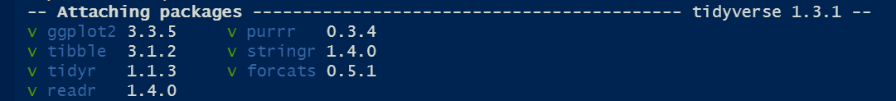

<style type="text/css">
div.main-container {
  max-width: 1600px;
  margin-left: auto;
  margin-right: auto;
}
</style>

# [Tidyverse](https://www.tidyverse.org/)          

Este paquete agrupa una serie de paquetes que tienen una misma lógica en su diseño y por ende funcionan en armonía. Primero vamos a ver algunos de los principales comandos y luego vamos a ver algunos ejemplos de cómo podemos usar las funciones de este paquete. 

Entre ellos principalmente usaremos:

* [__dplyr__](https://dplyr.tidyverse.org/) y [__tidyr__](https://tidyr.tidyverse.org/) para consultar, realizar transformaciones y agregaciones sobre los sets de datos
* [__lubridate__](https://lubridate.tidyverse.org/) para trabajar con datos tipo fecha
* [__stringr__](https://stringr.tidyverse.org/) para trabajar con datos tipo string
* [__ggplot2__](https://ggplot2.tidyverse.org/) para realizar gráficos

A continuación cargamos la librería a nuestro ambiente. Para ello debe estar previamente instalada en nuestra pc o se instala con ```install.packages()```.

```{r, message=FALSE, warning=FALSE}
library(tidyverse)
library(lubridate) # para trabajar con fechas
```

{width=800}

Para mostrar el funcionamiento básico de tidyverse retomaremos el ejemplo de la Clase 1, con lo cual volvemos a crear el set de datos del [Indice de salarios](https://www.indec.gob.ar/indec/web/Nivel4-Tema-4-31-61) del INDEC.

``` {r, warning=FALSE}
INDICE  <- c( 394.5, 350.7, 346.3,
              408.4, 360.8, 349.5,
              415.6, 375.3, 353.5 )

FECHA  <-  c("Abr-21", "Abr-21", "Abr-21",
             "May-21", "May-21", "May-21", 
             "Jun-21", "Jun-21", "Jun-21")

GRUPO  <-  c("Privado_Registrado","Público","Privado_No_Registrado",
             "Privado_Registrado","Público","Privado_No_Registrado",
             "Privado_Registrado","Público","Privado_No_Registrado")

Datos <- data.frame(INDICE, FECHA, GRUPO)
Datos
```

## Dplyr

El caracter principal para utilizar este paquete es ```%>%``` , _pipe_ (de tubería).

Los ```%>%``` toman el set de datos a su izquierda, y los transforman mediante los comandos a su derecha, en los cuales los elementos de la izquierda están implícitos. En otros términos.

$f(x,y)$ es equivalente a $x$ %>% $f(.,y)$ 

Veamos las principales funciones que pueden utilizarse con la lógica de este paquete:

### Glimpse

Permite ver la estructura de la tabla. Nos muestra: 

* número de filas
* número de columnas
* nombre de las columnas
* tipo de dato de cada columna
* las primeras observaciones de la tabla

```{r}
glimpse(Datos)
```
```{r}
Datos %>% 
  glimpse()
```

### filter

Permite filtrar la tabla acorde al cumplimiento de condiciones lógicas
 
```{r}
Datos %>% 
  filter(INDICE > 400 , GRUPO == "Privado_Registrado")
```

Nótese que en este caso al separar con una (coma) `,` las condiciones se exige el cumplimiento de ambas. En caso de desear que se cumpla una sola condición debe utilizarse el caracter `|` (una condición "o" la otra).

```{r}
Datos %>% 
  filter(INDICE > 400 | GRUPO == "Privado_Registrado")
```

### rename

Permite renombrar una columna de la tabla. Funciona de la siguiente manera: 
 ```Data %>% rename( nuevo_nombre = viejo_nombre )``` 
 
```{r}
Datos %>% 
  rename(Periodo = FECHA)
```

Nótese que a diferencia del ejemplo de la función __filter__ donde utilizábamos __==__ para comprobar una condición lógica, en este caso se utiliza sólo un __=__ ya que lo estamos haciendo es _asignar_ un nombre.

### mutate

Permite agregar una nueva variable a la tabla (especificando el nombre que tomará esta), que puede ser el resultado de operaciones sobre otras variables de la misma tabla.       

> Ojo! En caso de especificar el nombre de una columna existente, el resultado de la operación realizada "sobrescribirá" la información de la columna con dicho nombre. 

```{r}
Datos <- Datos %>% 
  mutate(Doble = INDICE * 2)
Datos
```

### case_when

Permite definir una variable, la cual toma un valor particular para cada condición establecida. Los valores asignados deben ser siempre del mismo tipo (numérico, caracter, lógico, etc.).

En caso de no cumplir ninguna de las condiciones establecidas la variable tomara valor __NA__

La sintaxis de la función es  ```case_when(condicion lógica1 ~ valor asignado1, condicion lógica2 ~ valor asignado2)```.

```{r}
Datos <- Datos %>% 
  mutate(Caso_cuando = case_when(GRUPO == "Privado_Registrado" ~ INDICE * 2,
                                 GRUPO == "Público"            ~ INDICE * 3))
Datos
```
Una forma de manejar la asignación de valores faltantes es crear una "condición" que sea igual a TRUE. Esto funciona como la parte de **else** de una estructura condicional y la sintaxis es ```case_when(condicion lógica1 ~ valor asignado1, TRUE ~ valor asignado en caso de no cumplirse la/s condicion/es previas)```.

```{r}
Datos %>% 
  mutate(Caso_cuando = case_when(GRUPO == "Privado_Registrado" ~ INDICE * 2,
                                 GRUPO == "Público"            ~ INDICE * 3,
                                 TRUE ~ 1000)) 
```
Como la función `case_when` va recorriendo las condiciones en forma secuencial, si repetimos una condición asingando un nuevo valor, el valor que prevalece será el de la primera. Veamos cómo sería el caso:  

```{r}
Datos %>% 
  mutate(Caso_cuando = case_when(GRUPO == "Privado_Registrado" ~ INDICE,
                                 GRUPO == "Público"            ~ INDICE * 3,
                                 # repetimos la condición 1 pero asignando otro valor
                                 GRUPO == "Privado_Registrado" ~ INDICE * 2,
                                 TRUE ~ 1000))
```

### select

Permite especificar la serie de columnas que se desea conservar de un DataFrame. También pueden especificarse las columnas que se desean descartar (agregándoles un _-_). Muy útil para agilizar el trabajo en bases de datos de gran tamaño.

Así como con la función ```filter()``` se filtran filas de interés, en este caso, la función ```select()``` permite seleccionar columnas de interés, reduciendo la dimensionalidad de la base con la cual trabajar.

```{r}
Datos2 <- Datos %>% 
  select(INDICE, FECHA, GRUPO)
Datos2
# o lo que es igual
Datos <- Datos %>% 
  select(-c(Doble, Caso_cuando))
```

### arrange

Permite ordenar la tabla por los valores de determinada/s variable/s. Es útil cuando luego deben hacerse otras operaciones que requieran del ordenamiento de la tabla. 

Por default ordena en forma ascendente, si queremos que alguna variable quede ordenada en forma descendente hay que usar ```desc()```. 

```{r}
Datos <- Datos %>% 
  arrange(GRUPO, INDICE)
Datos
```


```{r}
# o en forma descendente
Datos <- Datos %>% 
  arrange(GRUPO, desc(INDICE))
Datos
```

### summarise

Crea una nueva tabla que resuma la información original. Para ello, definimos las variables de resumen y las formas de agregación.

```{r}
# por ejemplo calculamos la media del INDICE
Datos %>% 
  summarise(Indprom = mean(INDICE))
```

### group_by

Esta función permite realizar operaciones de forma agrupada. Lo que hace la función es "separar" a la tabla según los valores de la variable indicada y realizar las operaciones que se especifican a continuación, de manera independiente para cada una de las "subtablas". 

En nuestro ejemplo, sería útil para calcular el promedio de los indices por _Fecha_. 

```{r}
Datos %>% 
  group_by(FECHA) %>%
  summarise(Indprom = mean(INDICE))
```

## Joins

Otra implementación muy importante del paquete dplyr son las funciones para unir tablas (joins)

{width=500}        

### left_join

Veamos un ejemplo de la función __left_join__ (una de las más utilizadas en la práctica). Para ello, es necesario tener dos tablas y una columna que será la que servirá para unir ambas. 

Para ello crearemos previamente un Dataframe que contenga un Ponderador para cada uno de los Grupos del Dataframe _Datos_. Aprovecharemos el ejemplo para introducir la función __weigthed.mean__, y así calcular un Indice Ponderado.

```{r}
# creamos un dataframe de ponderadores con la columna GRUPO igual al dataset original
Ponderadores <- data.frame(GRUPO = c("Privado_Registrado", "Público", "Privado_No_Registrado"), PONDERADOR = c(50.16,29.91,19.93))
Ponderadores
```


```{r}
# hacemos el join con el dataframe Datos 
Datos_join <- Datos %>% 
# especificamos la variable que será utilizada para unir ambas tablas con "by"
  left_join(., Ponderadores, by = "GRUPO")
Datos_join
# agrupamos para calcular el indice ponderado
Datos_Indice_Gral <- Datos_join %>% 
  group_by(FECHA) %>% 
  summarise(Indice_Gral = weighted.mean(INDICE, w = PONDERADOR))
Datos_Indice_Gral
```

Para más detalle sobre joins, ver notebook opcional de distintos tipos de [joins](https://eea-uba.github.io/EEA-2021/clase%202/Clase 2. Distintos tipos de Join (OPCIONAL).nb.html).

## Tidyr

El paquete tidyr esta pensado para "emprolijar los datos". Tiene un conjunto de funciones para implementar las nociones de Tidy Data desarrolladas por Hadley Wickham en su [paper](https://www.researchgate.net/publication/215990669_Tidy_data).

En el enfoque de *tidy data*:

1. Cada variable conforma una columna
2. Cada observación conforma una fila
3. Cada tipo de unidad observacional conforma una tabla 

Veremos dos funciones muy útiles para trabajar con este enfoque:

__pivot_longer__ (previamente __gather__): es una función que nos permite pasar los datos de forma horizontal a una forma vertical. 

__pivot_wider__ (previamente __spread__): es una función que nos permite pasar los datos de forma vertical a una forma horizontal.

La funcionalidad es similar entre estas dos versiones, aunque __pivot_longer__ y __pivot_wider__ corresponden a un enfoque actualizado de las otras funciones, diseñado para ser más simple de usar y para manejar más casos de uso. Cabe destacar, que __gather__ y __spread__ ya no cuentan con mantenimiento y los autores de la librería recomiendan enfáticamente el uso de las nuevas versiones.

{width=500}

En la siguiente tabla (iris) cada observación es una planta con la medición del largo y ancho de su sépalo y pétalo y el tipo de especie a la cual pertenece.

```{r}
# Utilizamos un conjunto de datos que viene con la librería datasets
library(datasets)
data(iris)
iris <- iris %>% 
  mutate(id = 1:nrow(.)) %>% # se agrega un ID
  select(id, everything()) # se acomoda para que el id este primero. 
iris
```

### Pivot_longer (ex gather) 

Ahora se considera que cada observación es la medición de cada uno de los 4 atributos de la planta para cada una de las plantas, entonces deberíamos "pivotear" la tabla para tener el tipo de medición como una variable.

```{r}
iris_vertical <- iris %>% 
                    pivot_longer(# Columnas a pivotear al formato "largo"
                                 cols = c(Sepal.Length, Sepal.Width, Petal.Length,Petal.Width),       
                                 # nombre de la nueva columna sobre la que se pivotea el dataframe
                                 names_to = "tipo_medicion", 
                                 # nombre de la nueva columna de valores
                                 values_to = "valor" )
iris_vertical
```

### Pivot_wider (ex spread)

Podemos deshacer el __pivot_longer__ con un __pivot_wider__

```{r}
iris_horizontal <- iris_vertical %>%
                      pivot_wider(# nombre de la variable a expandir
                                  names_from = tipo_medicion, 
                                  # nombre de la columna con valores
                                  values_from = valor) 
iris_horizontal
```

## [Lubridate](https://lubridate.tidyverse.org/)

El paquete lubridate está pensado para trabajar con los datos tipo fecha(date) o fecha-hora(datetime) para cambiarles el formato, realizar operaciones y extraer información.

### Cambio de formato

Existe una gran cantidad de funciones para realizar esto. La idea general es poder llevar los objetos *datetime* a un formato común compuesto de los elementos: año, mes, día, hora, minuto y segundo (también se puede setear el huso horario).

```{r}
fecha  <- "04/12/92 17:35:16"
fecha
class(fecha)
```

Con la función ```dmy_hms()``` podemos convertir este string a una fecha: estamos indicando que el formato de la fecha es día(d), mes(m), año(y), hora(h), minuto(m) y segundo(s).

```{r}
fecha  <- dmy_hms(fecha)
fecha
class(fecha)
```

Muchas funciones de lubridate operan con esta misma lógica.

Otra función para realizar un cambio de formato es *parse_date_time*. Permite construir objetos *datetime* a partir de datos más complejos, como por ejemplo cuando aparece el nombre del mes y el año.

En el parámetro *x* pasamos el dato de la fecha y en el parámetro *orders* especificamos el orden en el cual se encuentra la información de la fecha, por ejemplo, mes y año (my).

```{r}
fecha2  <- "Dec-92"
fecha2 <- parse_date_time(fecha2, orders = 'my')
fecha2
```

### Extracción de información

Existen muchas funciones muy sencillas para extraer información de un objeto datetime. Algunas son:

```{r}
year(fecha) # Obtener el año
month(fecha) # Obtener el mes
day(fecha) # Obtener el día
wday(fecha, label = TRUE) # Obtener el nombre del día
hour(fecha) # Obtener la hora
```

### Operaciones

Podemos sumar o restarle cualquier período de tiempo a un objeto datetime.

```{r}
# Sumo dos días 
fecha + days(2)
# Resto 1 semana y dos horas
fecha - (weeks(1) + hours(2))
```

## Stringr

Basado en la [clase](https://jmbarriola.github.io/ATR-2019/Clase%205/clase5_strings_y_fechas.nb.html) de Milena Dotta y Juan Barriola

Vamos a usar un paquete muy útil para manejar variables de tipo string, es decir, variables de texto, llamado ```stringr()```. Este paquete cuenta con una cheat sheet que pueden consultar siguiendo este [link](http://edrub.in/CheatSheets/cheatSheetStringr.pdf).

### str_length

Con la función ```str_length()``` podemos ver el largo de un string.

```{r}
string1 <- "abcdefghi"
str_length(string1)
```

> Cuidado que cuenta los espacios en blanco como un caracter!

```{r}
string2 <- "abcd efghi"
str_length(string2)
```

La función ```str_sub()``` nos permite extraer los caracteres que se encuentran entre determinadas posiciones. Tiene tres argumentos: el **string**, el orden del caracter **a partir** del cual tiene que empezar a extraer y el orden del caracter **hasta** el cual tiene que extraer.

```{r}
#quiero el tercer caracter
str_sub(string1,3,3)
#quiero el cuarto y quinto caracter
str_sub(string1,4,5)
```

Puedo pasarle la posición de los caracteres con un menos para indicar que quiero que cuente de atrás para adelante. Por ejemplo, si quiero que traiga el anteúltimo caracter llamo a la posición como -2.

```{r}
#quiero la última y anteúltima posición
str_sub(string1,-2,-1)
```

Otro uso que le podemos dar a este comando es el de reemplazar elementos. Supongamos que quiero reemplazar la última letra por una z.

```{r}
str_sub(string1,-1,-1) <- "z"
string1
```

### Manejo de espacios en blanco

Es frecuente que aparezcan datos mal cargados o con errores de tipeo que tienen espacios donde no debería haberlos. La función ```str_trim()``` permite que nos deshagamos de los espacios en blanco a izquierda, derecha o ambos lados de nuestro string.

```{r}
string3 <- c("  acelga   ", "brocoli   ",  "   choclo")
#Veamos el string
string3
```

Quitamos los espacios en blanco a ambos lados con el argumento ```side=‘both’```

```{r}
str_trim(string3, side = 'both')
```

Quitamos los espacios en blanco del lado izquierdo con el argumento ```side=‘left’```

```{r}
str_trim(string3, "left")
```

### Mayúsculas y minúsculas

Existen varias funciones para manipular las mayusculas/minúsculas de nuestros strings. A modo de sugerencia, siempre es convientiente manejarse con todos los caracteres en minúscula o en mayúscula. Esto ayuda a normalizar la información para armar mejor grupos, joinear tablas, etc.

```{r}
string4 <- "No me gusta el frio"
string4
#llevo todo a minúsculas
str_to_lower(string4)
#llevo todo a mayúsculas
str_to_upper(string4)
#llevo a mayúscula la primer letra de cada palabra
str_to_title(string4)
```

### str_split

La función ```str_split()``` nos permite partir un string de acuerdo a algún separador/patron (pattern) que definamos.

```{r}
#quiero separar todas las letras de mi string
string1_separado <- str_split(string1,pattern = "")
string1_separado
```

Notemos que esta funcion nos devuelve una lista

```{r}
class(string1_separado)
# Si queremos acceder al primer elemento de la lista
string1_separado[[1]][1]
```

Definimos un nuevo string

```{r}
string5 <- "ab-cd-ef"
string5
```

Lo separamos por el guion

```{r}
str_split(string5, pattern = "-")
```

### Reemplazar elementos de strings

La función base `gsub()` nos permite reemplazar parte del string por otra cosa. Las funciones `str_replace()` y `str_replace_all()` de stringr nos permiten hacer lo mismo.

`str_replace` solo reemplaza la primera ocurrencia del patron mientras que `str_replace_all()` reemplaza todas las ocurrencias


```{r}
string6 <- "todos los caballos blancos"
string6
#le sacamos los espacios
gsub(pattern = " ", replacement = "", x = string6)
#lo llevamos a lenguaje inclusivo
gsub(pattern = "os", replacement = "xs", x = string6)
```

Con stringr

```{r}
# Reemplazamos la primera ocurrencia
str_replace(string = string6, pattern = "os", replacement = "xs")
# Reemplazamos todas las ocurrencias
str_replace_all(string = string6, pattern = "os", replacement = "xs")
```

### Detectar patrones en strings

La función `grepl()` nos permite encontrar expresiones dentro de nuestros strings. Nos reporta VERDADERO o FALSO de acuerdo a si encuentra la expresión que estamos buscando.

La funcion `str_detect()` de `stringr` permite hacer lo mismo.

```{r}
string7 <-c("caño", "baño", "ladrillo")
string7
grepl(pattern = "ñ",x = string7)
str_detect(pattern = "ñ", string = string7)
```


## Ggplot2

`ggplot` tiene su sintaxis propia. La idea central es pensar los gráficos como una sucesión de capas, que se construyen una a la vez.    

- El operador __```+```__ nos permite incorporar nuevas capas al gráfico.

- El comando ```ggplot()``` nos permite definir los __datos__ y las __variables__ (x, y, color, forma, etc.). 

- Las sucesivas capas nos permiten definir:
    - Uno o más tipos de gráficos (de columnas, ```geom_col()```, de línea, ```geom_line()```, de puntos,```geom_point()```, boxplot, ```geom_boxplot()```)
    - Títulos ```labs()```
    - Estilo del gráfico ```theme()```
    - Escalas de los ejes ```scale_y_continuous```,```scale_x_discrete``` 
    - División en subconjuntos ```facet_wrap()```,```facet_grid()```

`ggplot` tiene __muchos__ comandos, y no tiene sentido saberlos de memoria, es siempre útil reutilizar gráficos viejos y tener a mano el [machete](data-visualization.pdf).

También hay otros machetes útiles que ofrece RStudio. Pueden descargarlos en el siguiente [link](https://www.rstudio.com/resources/cheatsheets/). 

```{r}
# usando el dataset iris anterior
library(ggplot2)
library(ggthemes)  # estilos de gráficos
library(ggrepel)   # etiquetas de texto más prolijas que las de ggplot
library(scales)    # tiene la función 'percent()'
ggplot(data = iris, aes(x = Petal.Length, Petal.Width, color = Species)) +
  geom_point(alpha = 0.75) + # agregamos transparencia a los puntos
  labs(title = "Medidas de los pétalos por especie") + 
  theme(legend.position = 'none') + 
  facet_wrap(~ Species)
```

### Capas del Gráfico

Veamos ahora, el "paso a paso" del armado del mismo. 

En primera instancia solo defino los ejes. Y en este caso un color particular para cada Especie.

```{r}
g <- ggplot(data = iris, aes(x = Petal.Length, Petal.Width, color = Species))
g
```

Luego, defino el tipo de gráfico. El *alpha* me permite definir la intensidad/transparencia de los puntos.

```{r}
g <- g +  geom_point(alpha = 0.25)
g
```  
Las siguientes tres capas me permiten respectivamente: 
 
 - Definir el título del gráfico
 - Quitar la leyenda
 - Abrir el gráfico en tres fragmentos, uno para cada especie

```{r} 
g <- g +
  labs(title = "Medidas de los pétalos por especie") +
  theme(legend.position = 'none') +
  facet_wrap(~ Species)
g
```

### Extensiones de [GGplot](http://www.ggplot2-exts.org/gallery/)

La librería GGplot tiene a su vez muchas otras librerías que extienden sus potencialidades. Entre nuestras favoritas están:

- [gganimate](https://gganimate.com/): Para hacer gráficos animados.
- [ggridge](https://cran.r-project.org/web/packages/ggridges/vignettes/introduction.html): Para hacer gráficos de densidad faceteados
- [ggally](https://ggobi.github.io/ggally/): Para hacer varios gráficos juntos.

```{r, message=FALSE, warning=FALSE, fig.width=8, fig.height=6, results='hide',fig.keep='all'}
library(GGally)
ggpairs(iris,  mapping = aes(color = Species))
```


```{r}
library(ggridges)
ggplot(iris, aes(x = Sepal.Length, y = Species, fill = Species)) + 
  geom_density_ridges()
```

Lo útil de hacer gráficos en R, en lugar de por ejemplo excel, es que podemos hacer uso de más dimensiones, por ejemplo:

- Gráficos que necesitan la información a nivel de microdatos. __puntos__,  __boxplots__, __Kernels__, etc.
- Abrir el mismo gráfico según alguna variable discreta: ```facet_wrap()```
- Parametrizar otras variables, para aumentar la dimensionalidad del gráficos, a través de:
    - [__color__](http://www.stat.columbia.edu/~tzheng/files/Rcolor.pdf) ```color = ```
    - __relleno__```fill = ```
    - __forma__ ```shape = ```
    - __tamaño__ ```size = ```
    - __transparencia__ ```alpha = ```

Esto permite tener en el plano gráficos de muchas dimensiones de análisis.

Cuando queremos utilizar estos parámetros para representar una variable, los definimos __dentro del aes()__, ```aes(... color = ingresos)```, cuando queremos simplemente mejorar el diseño, se asignan por fuera, o dentro de cada tipo de gráficos, ```geom_col(color = 'green')```.

Para ejemplificar el uso de los gráficos se levanta una base de microdatos de Encuesta Permanente de Hogares (EPH) que publica INDEC.

```{r}
Individual_T120 <- read.table("../Fuentes/usu_individual_T120.txt",
                              sep=";", dec=",", header = TRUE, fill = TRUE)
```

### Boxplots

Hacemos un procesamiento simple de la base: Sacamos los ingresos iguales a cero y las no respuestas de nivel educativo (datos faltantes).    

Las variables sexo (*CH04*) y nivel educativo (*NIVEL_ED*) están codificadas como números, y el R las entiende como numéricas. Es importante que las variables sean del tipo que conceptualmente les corresponde (el nivel educativo es una variable categórica, no continua), para que el ggplot pueda graficarlo correctamente, por lo que se las convierte con ```as.factor()```. 

```{r}
ggdata <- Individual_T120 %>%
  filter(P21 > 0, !is.na(NIVEL_ED)) %>% 
  mutate(NIVEL_ED = as.factor(NIVEL_ED),
         CH04     = as.factor(CH04))
ggdata %>%
  head()
```

Si queremos hacer un boxplot del ingreso para cada nivel educativo, asignamos esta variable a _x, group y fill_

```{r}
ggplot(ggdata, aes(x = NIVEL_ED, y = P21, group = NIVEL_ED, fill = NIVEL_ED))+
  geom_boxplot() +
  scale_y_continuous(limits = c(0, 40000)) # definimos escala del eje y
```

Si queremos agregar la dimensión _sexo_, podemos utilizar el comando ```facet_wrap()```

```{r}
ggplot(ggdata, aes(x = NIVEL_ED, y = P21, group = NIVEL_ED, fill = NIVEL_ED))+
  geom_boxplot()+
  scale_y_continuous(limits = c(0, 40000))+
  facet_wrap(~ CH04, labeller = "label_both") # se abre el gráfico en fragmentos segun sexo
```

En este gráfico, el foco de atención sigue puesto en las diferencias de nivel educativo, pero _neutralizamos_ el efecto de la variable sexo.     

Si lo que queremos hacer es poner el foco de atención en las diferencias por sexo, _neutralizamos_ el efecto del nivel educativo, realizando la apertura por nivel educativo.

```{r}
ggplot(ggdata, aes(x = CH04, y = P21, group = CH04, fill = CH04 )) +
  geom_boxplot()+
  scale_y_continuous(limits = c(0, 40000))+
  facet_wrap(~ NIVEL_ED, labeller = "label_both") # se abre el gráfico en fragmentos segun nivel educativo
```
