---
title: "Guia de trabajo para los TPs"
author: "Juan Manuel Barriola y Sofía Perini"
output:
  html_document:
    df_print: paged
---

Esta es una pequeña guía sobre como proceder con la realización de los trabajos prácticos.

## 1. Crear un R Project

Los proyectos de R permiten trabajar manera ordenada ya que funcionan como carpetas o directorios. En ellos se guardan los scripts, notebooks, bases de datos, imagenes, etc y ademas se pueden vincular a herramientas de control de cambios (GIT).

Para crear un R Project

1. Seleccionar el menu de proyectos en la esquina superior derecha de R Studio

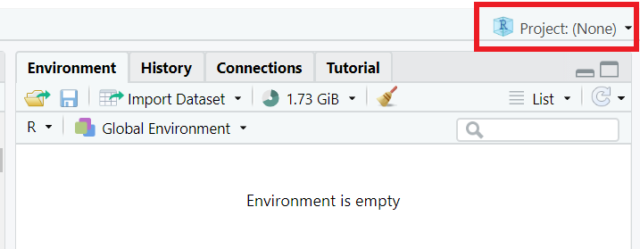{ width=75% }

2. Seleccionar **New Project...**

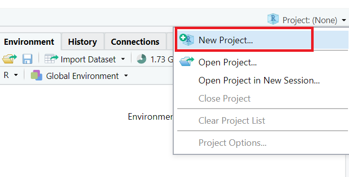{ width=75% }

3. Seleccionar **New Directory**. Las otras versiones permiten crear proyectos a partir de carpetas existentes o a partir de un repositorio de Git.

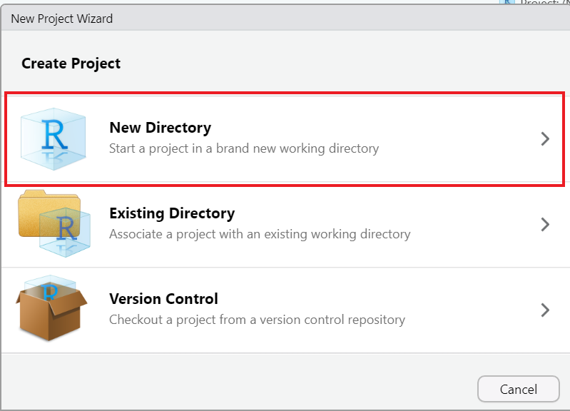{ height=75%, width=75%}

4. Seleccionar **New Project**

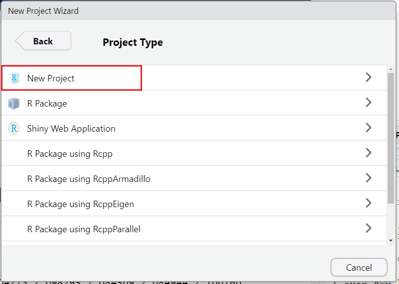{ height=75%, width=75%}

5. Escribir el nombre del directorio/proyecto en (1). Recomendamos que usen EEA-TPs como nombre. Seleccionar donde van a crear el proyecto en (2)

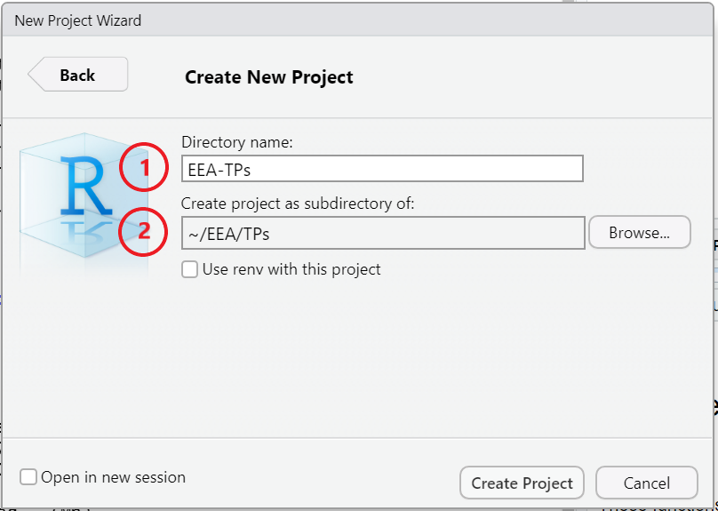{ height=75%, width=75%}

6. Esperar a que se cree el proyecto. Luego de creado deberían llegar a esta misma imagen: en la esquina superior derecha figura el nombre del proyecto y debajo en **Files** contar con el archivo *EEA-TPs.Rproj*

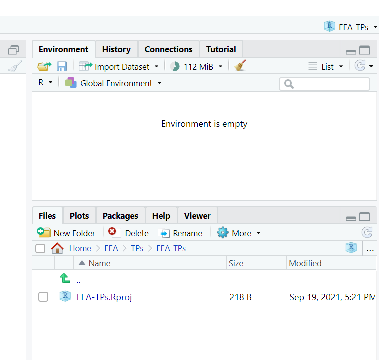{ height=66%, width=75%}

Ahora ya pueden comenzar a trabajar dentro del proyecto.

### Recomendaciones:

* Mantener un proyecto ordenado: organizar los scripts y notebooks en carpetas. Por ejemplo: crear una carpeta para cada trabajo práctico.

* No guardar el entorno de trabajo, es decir, no guardar el workspace al cerrar el proyecto.

## 2. Crear un R Notebook

Los notebooks de R son una gran herramienta para realizar analisis y proyectos ya que permiten combinar código, texto e imágenes. Además permiten darle distintos formatos al texto para crear documentos prolijos.

En este caso vamos a trabajar con los R Notebooks básicos que se compilan a html.

Para crear un R Notebook

1. Seleccionar el boton de nuevo archivo en la esquina superior izquierda de R Studio

{ width=75% }

2. Seleccionar **R Notebook**

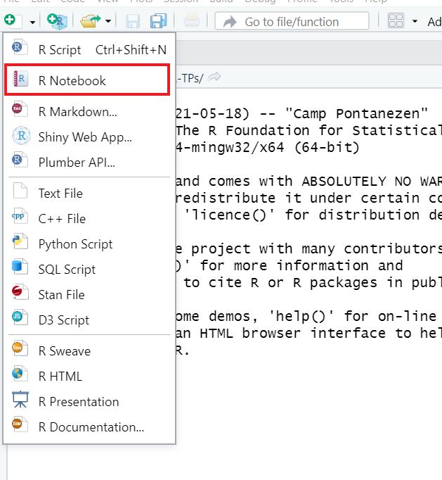{ width=75% }

3. Se les debe crear un nuevo notebook igual (o muy similar) a este

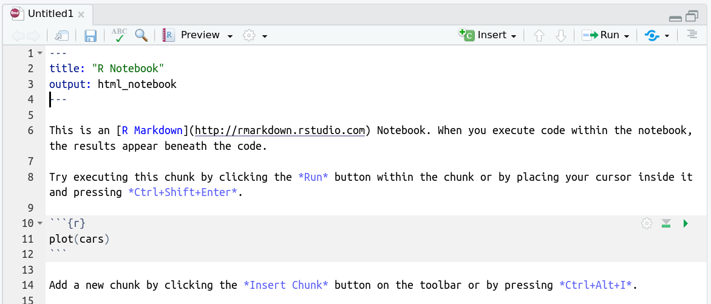{ height=75%, width=75%}

4. Cuando realicen una nueva parte de codigo deben ejecutar esa porcion para que su salida aparezca en el notebook. También pueden ejecutar todo el codigo del notebook haciendo click en el botón **Run** y luego en **Run All**.

Se pueden usar los atajos:

* Ctrl+Alt+R para correr todo el codigo
* Ctrl+Shift+Enter para correr el chunk (porción) de código

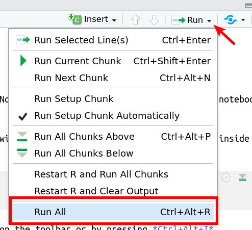{ height=75% }

5. Una vez que hayan ejecutado el código del notebook, deben hacer click en **Preview** y luego en **Preview Notebook** para poder visualizar el notebook.

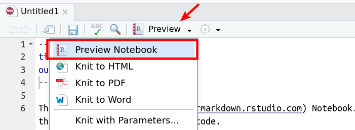{ height=75%, width=75%}

6. Si el archivo no está guardado, deberán guardarlo indicando el nombre del archivo. En este paso se crearán dos archivos:

* El archivo con extensión .Rmd es el **RMarkdown** en el cual se trabaja
* El archivo con extesión .nb.html es el documento compilado en html

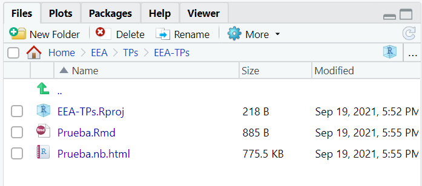{width=75%}

## 3. Compartir el archivo 

Una vez guardado y finalizado, pueden entregar el archivo como R notebook (extension .nb.html) o para entregar el archivo en formato html. Para ello deberan hacer click en donde dice Preview y seleccionar Knit HTML. 

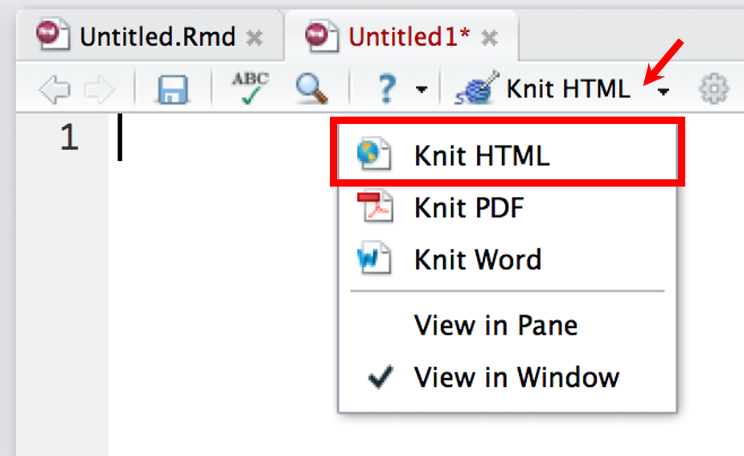{width=75%}

Luego se pedirá lo envíen al mail de la materia